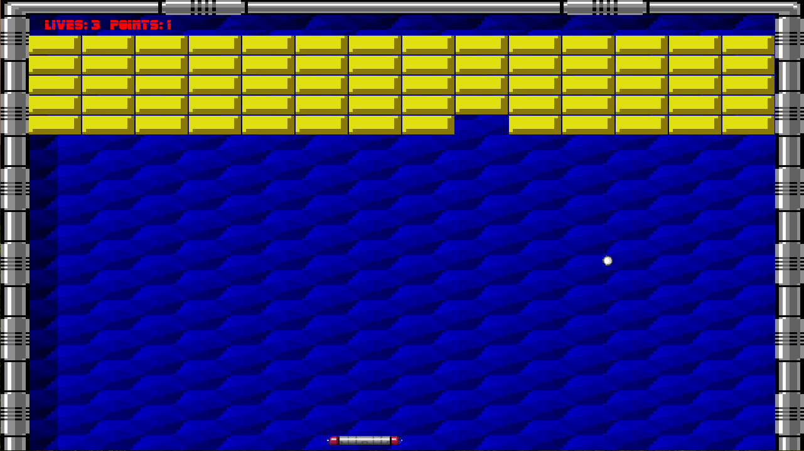
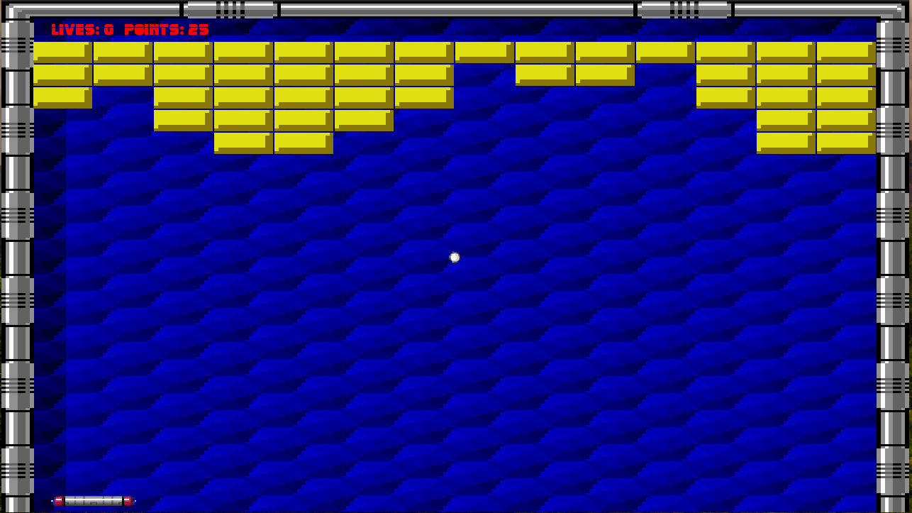
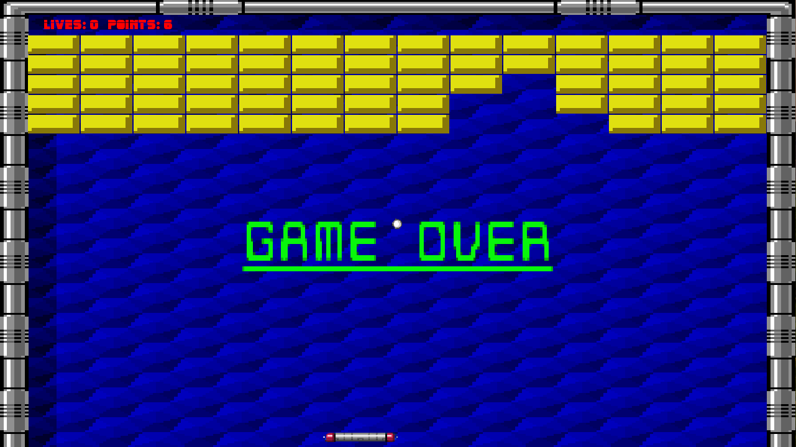

## Coders School Hackathon Project
# ARKANOID
Arkanoid is a 1986 block breaker arcade game developed and published by Taito.
We decided to recreate this game for Coders School Hackathon. It was created using C++ and SFML (https://www.sfml-dev.org).

### Authors:
J-Cieplinski - https://github.com/J-Cieplinski/

Kasperice - https://github.com/Kasperice/

Pawellos - https://github.com/pawellos/

### Gameplay:
link

### Screenshots:

### How to run:
1. Clone repository to your computer.
2. Create build directory inside:
   <code>mkdir build</code>
3. Go to build:
   <code>cd build</code>
4. Create cmake files
   <code>cmake ..</code>
5. Build
   <code>make</code>
6. Enjoy!
   <code>./HackathonArkanoid</code>

You don't have to include anything more, since we included all of the necessary materials inside repository.

Game is prepared to use 1280x720px resolution, if you don't have such a display feel free to edit windowWidth and windowHeight in Headers.hpp file (both values are in px).

### Contribution:
If you want to contribute to our project, you are welcome :) 
Just fork this repository, do your changes, check if it works and open Pull Request. We will check it and probably merge ;)

In case of any questions ask one of the above authors.

### What we have used?
Brick texture courtesy of Taito
https://www.spriters-resource.com/snes/arkanoiddohitagain/sheet/26517/

Sounds by J-Sinn
https://www.sounds-resource.com/nes/arkanoid/sound/3698/
